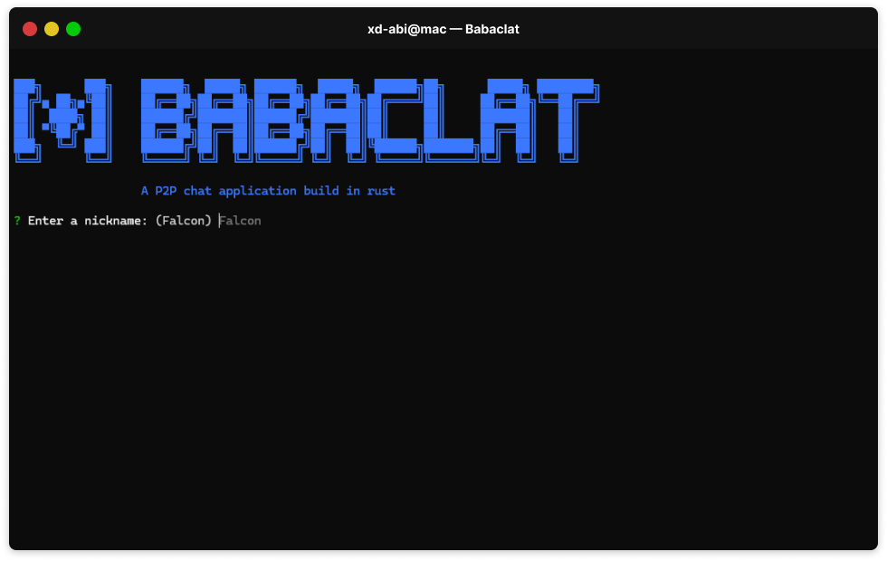

# 🗨️ Babaclat Chat



**Babaclat** is a peer-to-peer (P2P) chat application built in Rust, using the power of libp2p and Tokio for asynchronous network communication. It's a decentralized chat tool that allows you to connect with other local peers using gossipsub and mDNS protocols!

## 🚀 Installation & Setup

Follow these steps to build and run Babaclat on your machine:

```bash
git clone https://github.com/xd-Abi/babaclat.git
cd babaclat
cargo run --release
```

## 💡 How It Works

1. **🆔 Set Up Your Identity**:
   On the first run, Babaclat will generate a unique identity for you and save it locally. This helps in uniquely identifying you in the network.

2. **📡 Join the Local Chat Network**:
   The app automatically connects to peers in your local network using `mDNS` and starts discovering other Babaclat users.

3. **✉️ Send & Receive Messages**:
   You can send a message by typing it into the console.
   Messages are broadcasted using `gossipsub`, and all connected peers will receive your messages.

4. **🖧Peer-to-Peer Communication**:
   Babaclat is a true P2P chat application, meaning it **requires at least two nodes running on different computers** within the same network. If no other node is found, the app won’t be able to send or receive messages.

5. **👥 Show Who's Online**:
   When a new peer joins or leaves, a notification is shown in the chat.

## 📜 Command Guidelines

1. **Start Chatting**: Once you run the app, you'll be prompted to enter your nickname. The default is `Falcon`.
2. **Send a Message**: Just type your message in the console and press Enter. It will be broadcast to all the connected peers.
3. **User Join/Leave Notifications**: The app will show notifications when users join or leave the chat.

## 🔧 Technical Details

- **libp2p** is used for peer-to-peer communication.
- **mDNS** is used for peer discovery on the local network.
- **gossipsub** is the messaging protocol that handles message propagation.
- **tokio** provides the async runtime.
- **serde** is used for serializing and deserializing messages.
